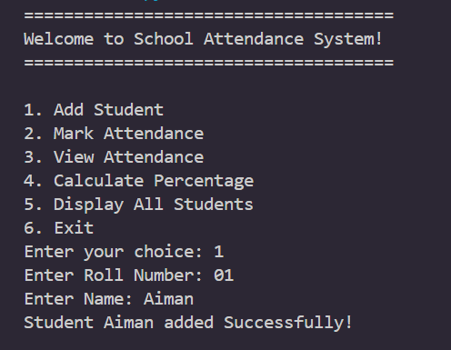
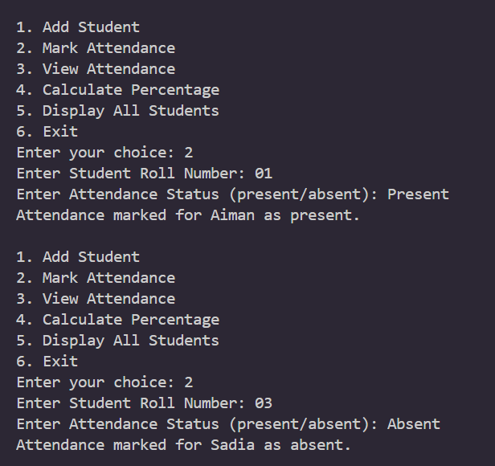
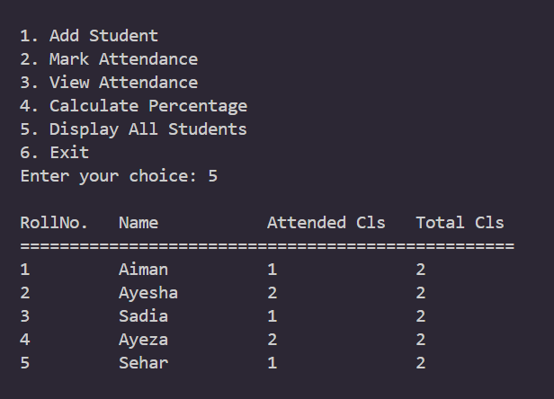
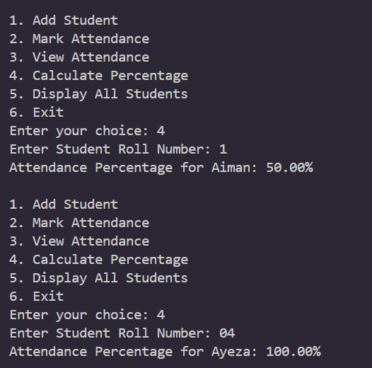
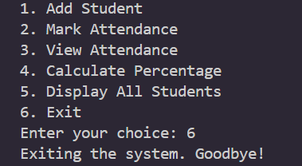

# 🎓 School Attendance System

A simple Python-based **School Attendance System** that allows users to add students, mark attendance, view attendance records, calculate attendance percentages, and manage student information through a menu-driven interface. 📚

## ✨ Features

- 👤 Add students with roll number and name
- ✅ Mark students as present or absent
- 📋 View individual attendance records
- 📊 Calculate attendance percentage
- 👥 Display all registered students
- 🔢 Track total and attended classes
- 🚪 Exit the system through the menu
- 🧩 Uses Python classes and functions

## 🛠️ Technologies Used

- 🐍 Python
- 🏗️ Object-Oriented Programming (OOP)
- 📦 Classes and Objects
- 🔀 Conditional Statements
- 🔁 Loops
- ⌨️ User Input
- 📊 Basic Calculations
- 📝 String Formatting

## ⚙️ How It Works

1. 👤 Add a student by entering their roll number and name.
2. ✅ Mark their attendance as present or absent.
3. 📋 View the student's attendance record.
4. 📊 Calculate their attendance percentage.
5. 👥 Display all registered students in a formatted table.
6. 🚪 Exit the system when finished.

## 📊 Attendance Percentage

The system calculates attendance percentage using:

```text
Attendance Percentage = (Attended Classes / Total Classes) × 100
## 🖥️ Project Screenshots

### 📝 Add Student



### ✅ Mark Attendance



### 📋 Attendance Table



### 📊 Attendance Percentage



### 🚪 Exit System



### 📁 Project Structure

```text
School-Attendance-System/
│
├── 🐍 main.py
├── 📖 README.md
├── 🚫 .gitignore
│
└── 🖼️ Screenshots/
    ├── add-student.png
    ├── mark-attendance.png
    ├── attendance-table.png
    ├── attendance-percentage.png
    └── exit.png